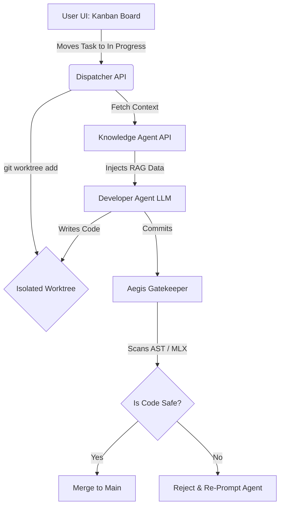

<div align="center">
  
  
  
  
  
  
  <br />
  <br />
  
  <h1>🌌 Know-Task-OS</h1>
  
  <p><b>The ultimate Local-First Agentic Mesh and Visual Operating System.</b></p>
  <p><i>A collaborative Kanban task management system designed for both human teams and autonomous AI agents. Features offline MLX execution and Rust security scanning.</i></p>

</div>

---

## 📑 Table of Contents
- [Concept & Philosophy](#-concept--philosophy)
- [Monorepo Architecture](#-monorepo-architecture)
- [The Agentic Mesh (Core Modules)](#-the-agentic-mesh-core-modules)
  - [1. Visual Dispatcher (Kanban)](#1-visual-dispatcher-kanban)
  - [2. Knowledge Agent (RAG Librarian)](#2-knowledge-agent-rag-librarian)
  - [3. Aegis Gatekeeper (Security)](#3-aegis-gatekeeper-security)
- [System Topography](#-system-topography)
- [Getting Started](#-getting-started)
- [Tags & Meta](#-tags--meta)

---

## 🧠 Concept & Philosophy

> 🍏 **Part of the Mac AI Ecosystem Initiative**
> *Этот проект является частью масштабной инициативы по созданию недостающих хардкорных инструментов и расширений для AI-разработки на Apple Silicon.*

Traditional autonomous agents write code directly into your repository, often breaking the main branch, hallucinating context, or leaking credentials. **Know-Task-OS** solves this by enforcing a strict, visual, step-by-step pipeline:

1. **Isolation First:** Every task dragged into "In Progress" triggers a `git worktree add` command. Agents operate in isolated sandbox folders. The `main` branch is mathematically protected.
2. **Contextual Precision:** Instead of flooding the LLM with the entire codebase, the native Vector RAG module feeds the agent only semantically relevant files.
3. **Shift-Left Security:** Before any AI-generated code is committed, an offline Rust-based neural network scans the diffs for leaked secrets, missing tests, and architectural drift.

---

## 🏗 Monorepo Architecture

This project is built as a high-performance **Turborepo**. It physically merges multiple independent AI systems into one cohesive operational mesh.

```text
Know-Task-OS/
├── apps/
│   ├── dispatcher-api/       # Python FastAPI Backend for Kanban Orchestration
│   ├── dispatcher-web/       # React/Vite Premium UI (Glassmorphism + SSE Terminal)
│   ├── knowledge-api/        # RAG Vector Engine & Embeddings API
│   ├── knowledge-web/        # Knowledge Management Dashboard
│   ├── security-brain/       # Local MLX/Neural Network for Secret Detection
│   ├── security-github-app/  # Webhooks and GitHub Integration
│   └── security-ui/          # Gatekeeper Review Interface
├── packages/
│   └── security-core/        # Blazing fast Rust core for AST parsing and diff scanning
├── turbo.json                # Turborepo Build Pipeline
└── package.json              # Global NPM Workspaces
```

---

## 🤖 The Agentic Mesh (Core Modules)

### 1. Visual Dispatcher (Kanban)
The central command hub. Acting as the Product Owner interface, you drag and drop tasks. The backend communicates via Server-Sent Events (SSE) to stream the agent's internal monologue ("Thoughts", "Commands", "Errors") directly into the UI's live terminal. If an agent gets stuck, it pauses execution and waits for human input via the **Stuck Protocol** modal.

### 2. Knowledge Agent (RAG Librarian)
A robust Retrieval-Augmented Generation engine. When a task requires architectural changes, the Knowledge Agent semantically indexes your codebase and internal wikis (using ChromaDB/Qdrant), providing the Developer Agent with surgical, high-fidelity context.

### 3. Aegis Gatekeeper (Security)
An offline-first, strict QA and Security module powered by Rust (`security-core`). It intercepts the Developer Agent's output. If the agent attempts to hardcode an API key or push un-tested spaghetti code, Aegis rejects the payload, pushing the Kanban card back to "In Progress" with a detailed error log.

---

## 🗺 System Topography (Data Flow)



---

## 🚀 Getting Started

### Prerequisites
- `Node.js` (v20+)
- `Python` (3.11+)
- `Rust` (cargo)
- `pnpm` or `npm` (for Turborepo)

### Installation
1. Clone the repository and install global dependencies:
   ```bash
   git clone https://github.com/helgklaizar/Know-Task-OS.git
   cd Know-Task-OS
   npm install
   ```

2. Start the entire Mesh ecosystem via Turbo:
   ```bash
   npm run dev
   ```

*(Turbo will concurrently spin up the React Dispatcher, the FastAPI orchestration backend, the Knowledge API, and compile the Rust Security core).*

---

## 🏷 Tags & Meta

**GitHub Description:**  
`A collaborative Kanban task management system designed for both human teams and autonomous AI agents.`

**Repository Tags:**  
`knowledge-base` `task-management` `business-os` `mlx` `apple-silicon` `fastapi` `rust`
